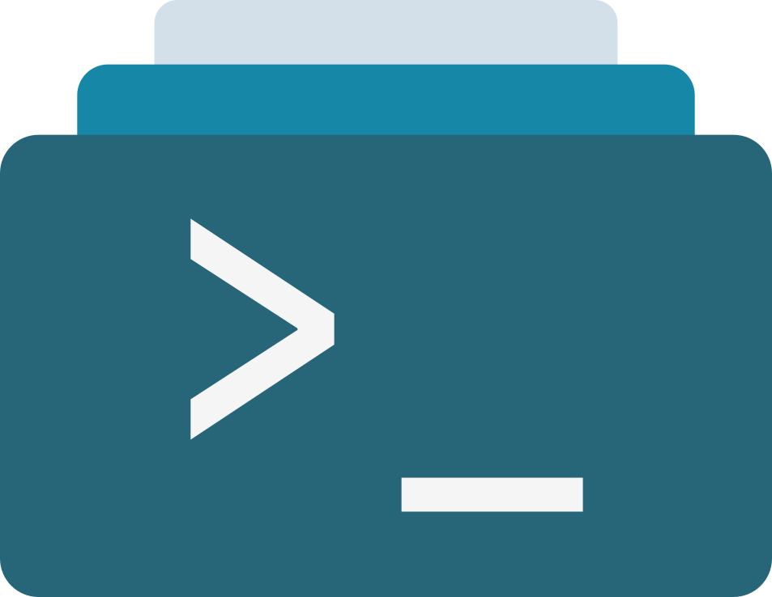

# deck-cli

 <p align="center">
  
</p>

deck-cli is a command-line tool for interacting with Nextcloud's [Deck Plugin](https://apps.nextcloud.com/apps/deck) by using it's [API](https://deck.readthedocs.io/en/latest/API/). I developed this tool to speed up working with Deck. Thus this application only covers a part of Deck's capabilities.


## Installation

```shell script
git clone https://github.com/72nd/deck-cli.git
cd deck-cli
pip install .
```


## Configuration

To connect with your Nextcloud instance deck-cli needs some informations. For this a configuration YAML file is used. A generic default config file can be created by using the `config` command:

```shell script
deck-cli config path/to/config.yaml
```

Now open the file in your editor and adapt it to your installation.

```yaml
# URL of your Nextcloud instance.
url: nc.example.com

# Nextcloud username
user: usr

# Password for the Nexcloud user
password: secret

# Defines stacks which contain the backlog (tasks not started yet).
# Used for the report generation.
backlog_stacks:
- Backlog

# Defines stacks which contain tasks in active processing. Used for
# the report generation.
progress_stacks:
- In Progress

# Defines the Name of stacks which contains done tasks. Used for the
# report generation.
done_stacks:
- Done

# Names of Boards which should be ignored.
ignore_board:
- Personal

# Define the timezone you'll enter dates into the application. This
# will most probably be your local timezone.
timezone: Europe/Berlin
```


## Add Card

